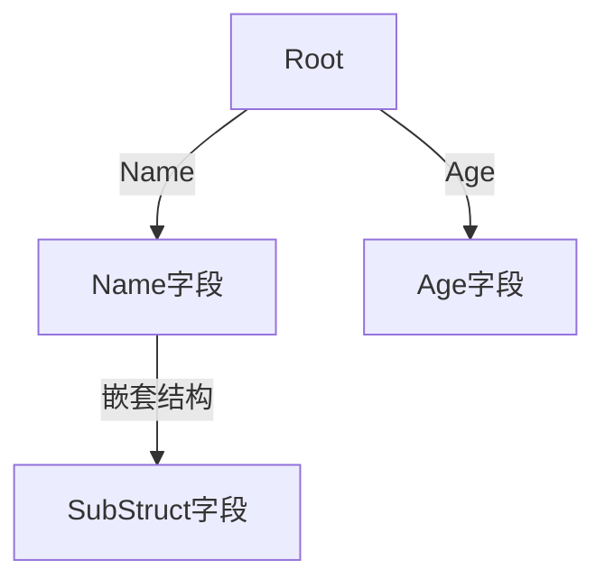

# 结构体拷贝工具技术文档

## 1. 核心功能
- 🔄 结构体字段拷贝（仅处理公共字段）
- 🏗️ 支持深拷贝（pure_reflect_copier）和浅拷贝（reflect_copier）
- ⚙️ 提供灵活的配置选项：
    - 🚫 忽略指定字段
      🔄 自定义字段类型转换
- 🌳 支持嵌套结构体拷贝

## 2. 核心接口
```go
type Copier[Src any, Dst any] interface {
    CopyTo(src *Src, dst *Dst, opts ...option.Option[options]) error
    Copy(src *Src, opts ...option.Option[options]) (*Dst, error)
}
```

## 3. 快速使用
```go
// 定义结构体
type User struct {
    Name string
    Age  int
}

type UserDTO struct {
    Name string
    Age  int
}

// 初始化copier
copier, _ := NewReflectCopier[User, UserDTO]()

// 执行拷贝
src := &User{Name: "张三", Age: 18}
dst, _ := copier.Copy(src)
```

## 4. 高级配置
### 忽略字段
```go
copier.Copy(src, IgnoreFields("Age")) // 忽略Age字段
```

### 类型转换
```go
copier.Copy(src, ConvertField("Name", func(s string) string {
    return "前缀_" + s
}))
```

## 5. 实现原理
### 字段映射


### 拷贝流程
1. 类型检查（必须为结构体指针）
2. 递归遍历字段
3. 处理指针和嵌套结构体
4. 应用转换规则
5. 执行值拷贝

## 6. 注意事项
1. 📌 源和目标字段类型必须匹配
2. ⚠️ 指针字段需要先初始化
3. 🚦 循环引用会导致栈溢出
4. ⏱️ 反射操作有性能损耗
5. 🔧 调试时使用--debug参数

## 7. 常见问题
Q: 为什么拷贝后字段值为空？
A: 检查：1. 字段是否公开 2. 类型是否匹配 3. 是否被忽略

Q: 如何处理嵌套结构体？
A: 工具会自动递归处理嵌套结构体字段

Q: 性能优化建议？
A: 1. 避免深层嵌套 2. 复用Copier实例 3. 减少反射类型判断
