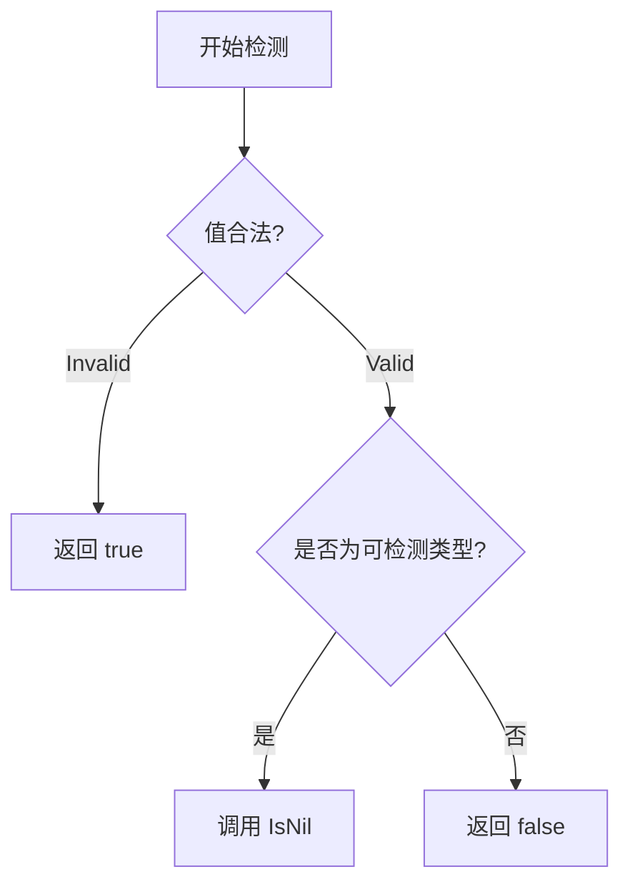

# reflectx 反射工具包技术文档

## 功能概述
✅ 安全检测反射值是否为 nil  
⚠️ 解决原生 `reflect.Value.IsNil()` 直接调用会 panic 的问题  
🛡️ 自动处理非法反射值场景

## 核心函数

### IsNilValue
```go
func IsNilValue(val reflect.Value) bool
```
#### 参数说明
- `val`: 需要检测的反射值对象

#### 返回值
- `true`: 当值为 nil 或非法反射值
- `false`: 非 nil 值或不可判类型

## 支持类型检测
| 类型              | 说明                  |
|-------------------|---------------------|
| Map               | 映射类型               |
| Chan              | 通道类型               |
| Slice             | 切片类型               |
| Interface         | 接口类型               |
| Ptr               | 指针类型               |
| Func              | 函数类型               |
| UnsafePointer     | 非安全指针类型           |

## 实现原理


## 使用示例
### 示例 1：检测指针
```go
var p *int
v := reflect.ValueOf(p)
fmt.Println(reflectx.IsNilValue(v)) // 输出 true
```

### 示例 2：检测非指针类型
```go
num := 42
v := reflect.ValueOf(num)
fmt.Println(reflectx.IsNilValue(v)) // 输出 false
```

## 注意事项
1. ⚠️ **不可检测类型**：  
   基础类型（int/string等）、结构体等类型永远返回 false

2. 🔄 **有效性检查优先**：  
   函数内部已自动处理 `val.IsValid()` 检查

3. 🚫 **不要用于原生类型判断**：  
   常规变量请直接使用 `== nil` 判断

## 常见问题
Q：为什么要用这个函数而不是直接调用 IsNil？  
A：原生 IsNil 在以下情况会 panic：
1. 值类型不可判 nil（如 int）
2. 反射值为 Invalid

Q：如何处理结构体指针字段？
```go
type User struct{ Name *string }
u := User{}
v := reflect.ValueOf(u).Field(0)
fmt.Println(reflectx.IsNilValue(v)) // 正确返回 true
```

Q：返回 false 是否一定表示非 nil？  
A：不完全是，以下情况返回 false：
1. 值确实非 nil
2. 类型不支持判 nil（如 int 类型的零值）
