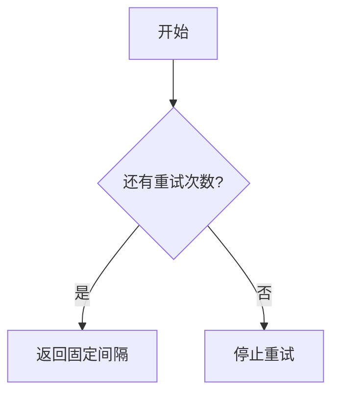

# 重试策略组件技术文档

## 1. 核心概念
✅ 提供两种重试策略实现：
- **固定间隔重试**：每次重试间隔相同时间
- **指数退避重试**：重试间隔按指数增长，直到达到最大值

## 2. 基础接口说明
```go
type Strategy interface {
    Next() (time.Duration, bool)
}
```
- `Next()` 方法返回：
    - 第一个参数：下次重试等待时间
    - 第二个参数：是否继续重试（true=继续）

## 3. 固定间隔重试（FixedIntervalRetry）

### 3.1 创建实例
```go
// 参数说明：
// interval: 固定间隔时间（必须>0）
// maxRetries: 最大重试次数（<=0表示无限重试）
strategy, err := retry.NewFixedIntervalRetryStrategy(
    time.Second, // 每隔1秒重试
    3,           // 最多重试3次
)
```

### 3.2 工作流程


### 3.3 典型场景
- API请求失败重试
- 数据库连接重试
- 需要固定频率轮询

## 4. 指数退避重试（ExponentialBackoffRetry）

### 4.1 创建实例
```go
// 参数说明：
// initialInterval: 初始间隔（必须>0）
// maxInterval: 最大间隔（必须≥初始间隔）
// maxRetries: 最大重试次数（<=0表示无限重试）
strategy, err := retry.NewExponentialBackoffRetryStrategy(
    time.Second,   // 初始1秒
    30*time.Second,// 最长等待30秒
    5,             // 最多重试5次
)
```

### 4.2 间隔计算规则
```
第1次重试：1秒 (1 * 2^0)
第2次重试：2秒 (1 * 2^1) 
第3次重试：4秒 (1 * 2^2)
...
直到达到maxInterval后固定使用最大值
```

### 4.3 适用场景
- 网络故障恢复
- 分布式系统协调
- 高并发压力场景

## 5. 使用示例
```go
// 创建策略（这里以指数退避为例）
strategy, _ := retry.NewExponentialBackoffRetryStrategy(
    time.Second, 30*time.Second, 5)

for {
    // 执行需要重试的操作
    err := doSomething()
    if err == nil {
        break
    }
    
    // 获取下次重试信息
    wait, ok := strategy.Next()
    if !ok {
        log.Println("达到最大重试次数")
        return
    }
    
    time.Sleep(wait)
}
```

## 6. 参数限制说明

| 参数              | 固定间隔重试 | 指数退避重试 | 校验规则                     |
|-------------------|-------------|-------------|----------------------------|
| interval          | ✅ 必须>0    | -           | 初始化时检查                 |
| initialInterval   | -           | ✅ 必须>0    | 初始化时检查                 |
| maxInterval       | -           | ✅ ≥initial  | 必须≥初始间隔                |
| maxRetries        | ✅ 任意整数   | ✅ 任意整数   | <=0表示无限重试             |

## 7. 重要注意事项
1. **线程安全**：两种策略均使用原子操作保证并发安全
2. **状态重置**：每次完整重试周期后需要新建策略实例
3. **性能影响**：指数退避的指数计算使用浮点运算（math.Pow）
4. **溢出保护**：当计算间隔超过最大值时自动使用maxInterval
5. **错误处理**：初始化参数非法会返回明确错误类型

## 8. 如何选择策略？

✅ 选择固定间隔重试当：
- 需要稳定频率重试
- 服务端有明确的速率限制
- 调试时观察稳定状态

✅ 选择指数退避重试当：
- 处理不可预测的暂时故障
- 避免雪崩效应
- 需要自适应调整请求压力

## 9. 常见问题

Q：为什么需要两种策略？  
A：不同场景需要不同的重试节奏控制方式

Q：如何实现无限重试？  
A：将maxRetries设为0或负数

Q：达到最大重试次数后还能恢复吗？  
A：需要新建策略实例重新开始计数

Q：如何处理策略初始化错误？
```go
strategy, err := NewExponentialBackoffRetryStrategy(...)
if errors.Is(err, errs.ErrInvalidIntervalValue) {
    // 处理无效间隔参数
}
if errors.Is(err, errs.ErrInvalidMaxIntervalValue) {
    // 处理最大间隔不合法
}
```